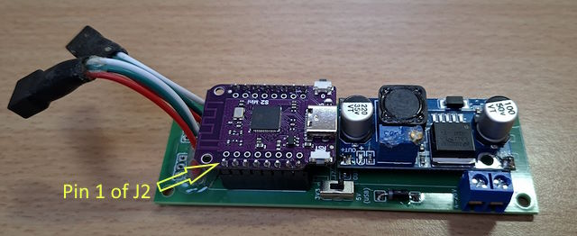

# Neopixel (variant WS2812b)

Two strings of 11 LEDs (WS2812b)
Microcontroler: Wemos S2 mini v1.0.0 flashed with [tasmota](https://templates.blakadder.com/s2_mini.html).

[Script](autoexec.be) has in code comments.

Image of the microcontroler:

[Diagram Wemos S2 mini v1.0.0](https://www.wemos.cc/en/latest/_static/files/sch_s2_mini_v1.0.0.pdf).
